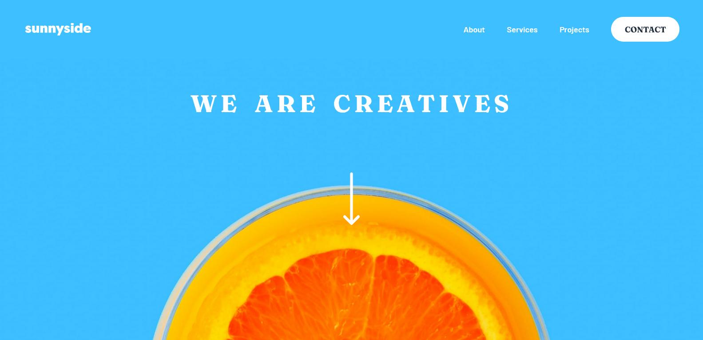
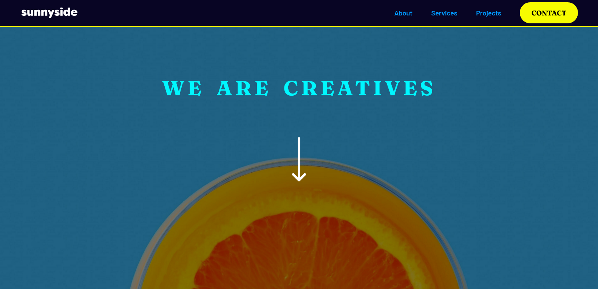
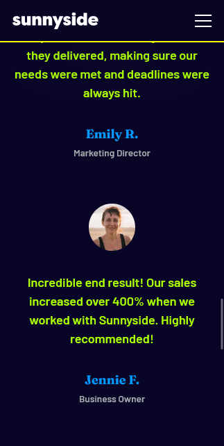

# Frontend Mentor - Sunnyside agency landing page solution

This is a solution to the [Sunnyside agency landing page challenge on Frontend Mentor](https://www.frontendmentor.io/challenges/sunnyside-agency-landing-page-7yVs3B6ef). Frontend Mentor challenges help you improve your coding skills by building realistic projects.

## Table of contents

- [Overview](#overview)
  - [The challenge](#the-challenge)
  - [Screenshot](#screenshot)
  - [Links](#links)
- [My process](#my-process)
  - [Built with](#built-with)
  <!-- - [What I learned](#what-i-learned) -->
  - [Continued development](#continued-development)
  <!-- - [Useful resources](#useful-resources) -->
- [Author](#author)
<!-- - [Acknowledgments](#acknowledgments) -->

## Overview

### The challenge

Users should be able to:

- View the optimal layout for the site depending on their device's screen size
- See hover states for all interactive elements on the page

### Screenshot

as given in the design

dark mode: additional feature added by me

### Links

- Solution URL: [@FrontendMentor](https://www.frontendmentor.io/solutions/responsive-sunnyside-agency-landing-page-built-w-sass-NnDjFdqQlu)
- Live Site URL: [I Live Here](https://basitkorai.github.io/sunnyside-agency/)

## My process

### Built with

- Semantic HTML5 markup
- CSS custom properties
- Flexbox
- CSS Grid
- Mobile-first workflow
- SASS - CSS with superpowers

### Continued development
- Improve UI
- Refactor Code

### Additional features (3)
- Dark Mode
- Hover underline animations on navigation links
- Floating arrow animation

<!-- ### Useful resources

- [Example resource 1](https://www.example.com) - This helped me for XYZ reason. I really liked this pattern and will use it going forward.
- [Example resource 2](https://www.example.com) - This is an amazing article which helped me finally understand XYZ. I'd recommend it to anyone still learning this concept. -->

## Author

- Website - work in progress
- Frontend Mentor - [@basit-flash](https://www.frontendmentor.io/profile/basit-flash)
- Twitter - [@basitxkorai](https://twitter.com/basitxkorai)

<!-- ## Acknowledgments -->
